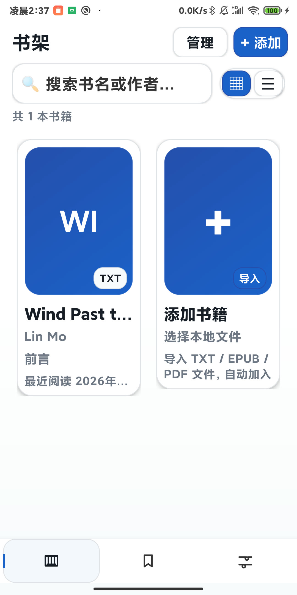
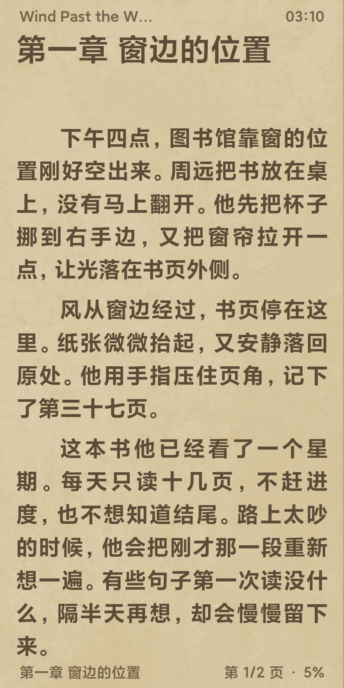
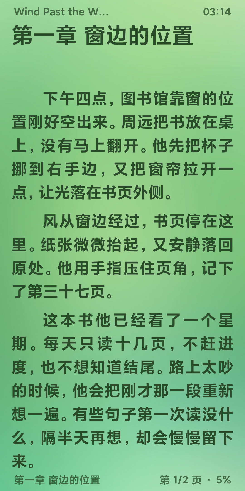

# PacilRead Mobile

PacilRead 的原生 Android 版本，包名是 `com.metahumanz.pacilread`。

它不是把电脑端套进 WebView，而是用 Kotlin 重新做了一套手机和平板界面。目标和 Windows 版一样：读自己的本地书，不加广告，不接书源，也尽量不让无关功能打断阅读。

## 界面

手机端保留了和 Windows 版相近的书架整理方式，但阅读页、菜单和触控操作都是按小屏重新做的。

<p align="center">
  
</p>

阅读页内置纸控、护眼和夜航三套预设，另外还能调整字体、字号、行距、页边距和背景图。

<table>
  <tr>
    <td></td>
    <td></td>
    <td></td>
  </tr>
  <tr>
    <td align="center">纸控</td>
    <td align="center">护眼</td>
    <td align="center">夜航</td>
  </tr>
</table>

## 现在能做什么

- 导入 TXT、EPUB 和 PDF，自动识别重复文件，也能把原书批量导出
- 本地书架支持标签、系列、阅读状态、搜索和批量管理
- 支持自定义封面，EPUB 可以自动提取书内封面
- 阅读页按屏幕分页，横屏和平板可以使用双页布局
- 支持平移、覆盖、仿真卷页、上下滚动和无动画等翻页方式
- 点击、滑动、音量键、键盘和鼠标滚轮都可以翻页
- 有目录、全文搜索、书签和替换规则，搜索索引会保存在本地
- 选中文字后可以复制、搜索、替换、从这里朗读，也可以生成引用分享卡
- 支持系统 TTS 和小米 MiMo，锁屏或切到后台后可以继续听
- 通知栏可以暂停、继续和停止听书，也能设置睡眠定时
- 支持自动翻页、自定义排版、阅读主题和背景图
- 记录阅读时间，支持日、周、月、年统计和图片报告
- 通过 WebDAV 同步阅读进度，并进行全量或增量备份恢复
- 浅色、深色资源分别适配，应用界面和阅读正文可以分开设置

## 和 Windows 版一起用

Windows 版在这里：[Metahumanz/PacilRead](https://github.com/Metahumanz/PacilRead)

两端配置同一个 WebDAV 目录后，可以共享阅读进度、书签、替换规则和阅读统计等数据。电脑端和手机端的界面偏好各自保存，不会因为同步把另一端的布局和操作习惯覆盖掉。

WebDAV 也可以用来做完整备份。除了书架记录，还能同步章节正文、封面和原始书籍文件，换设备时不必重新整理一遍。

## 安装

正式版本会放在仓库的 Releases 页面，下载 APK 后安装即可。最低支持 Android 8.0（API 26）。

如果设备上已经装过使用另一套签名打包的旧版本，Android 会拒绝直接覆盖。需要保留旧数据时，不要急着卸载，先在旧版本里做好备份。

## 自己编译

需要准备：

- JDK 17
- Android SDK，compileSdk 35
- Windows、PowerShell 或普通命令行环境

仓库统一使用 Gradle Wrapper，不需要单独安装 Gradle。

```powershell
.\gradlew.bat assembleDebug --no-daemon --console plain
.\gradlew.bat assembleRelease --no-daemon --console plain
.\gradlew.bat bundleRelease --no-daemon --console plain
```

也可以使用根目录里的 `pack.bat`：

```powershell
.\pack.bat debug
.\pack.bat release
.\pack.bat bundle
.\pack.bat install
```

构建结果默认在：

```text
app/build/outputs/apk/debug/
app/build/outputs/apk/release/
app/build/outputs/bundle/release/
```

### Android SDK 路径

如果仓库根目录没有 `local.properties`，可以自己创建：

```properties
sdk.dir=C\:\\Android\\SDK
```

`pack.bat` 也会尝试从 `ANDROID_HOME`、`ANDROID_SDK_ROOT`、Android Studio 和几个常见目录里寻找 SDK。

### 发布签名

没有配置签名时，Release 构建会生成未签名 APK。需要生成可以持续升级的正式包时，先创建自己的 keystore：

```powershell
keytool -genkeypair -v -keystore .\pacilread-release.jks -storetype PKCS12 -alias pacilread -keyalg RSA -keysize 2048 -validity 10000
```

然后把 `keystore.properties.example` 复制为 `keystore.properties`，填写路径、别名和密码。

`keystore.properties`、`local.properties` 和 `*.jks` 都已被 Git 忽略。keystore 一定要另外备份好；如果以后换了一把签名，同一个包名就不能直接覆盖更新。

## 听书

系统 TTS 使用设备里已经安装的语音服务，可以离线工作。小米 MiMo 使用 `mimo-v2.5-tts`，需要自己配置 API Key，目前内置冰糖、茉莉、苏打和白桦四种中文音色。

听书由前台媒体服务承载，切到后台或锁屏后不会立刻停止。睡眠定时支持快速滑块和精确到时分秒的设置，两种方式共用同一个一次性倒计时。

## 数据放在哪里

应用数据保存在 Android 私有目录的 `files/database/`。章节正文单独压缩后放在 `files/chapter_text/`，JSON 文件是当前唯一数据源，旧版 SQLite 数据库不再参与启动和迁移。

仓库里主要目录：

- `app/src/main/kotlin/`：Kotlin 源码
- `app/src/main/res/`：布局、主题、图标和其他 Android 资源
- `app/src/test/`：本地单元测试

## 开源与反馈

本项目和 Windows 版一样，使用 [GPLv3](LICENSE) 许可证。

遇到 Bug 或者同步问题，可以在仓库里提 Issue。最好顺手写上 Android 版本、PacilRead 版本和复现步骤，这样会比较好查。

## 致谢 / 灵感来源

做 PacilRead 时，我参考过下面两个项目的功能和交互：

- [Legado（阅读）](https://github.com/gedoor/legado)
- [ReadAny](https://github.com/codedogQBY/ReadAny)

感谢它们把代码和思路公开出来。
